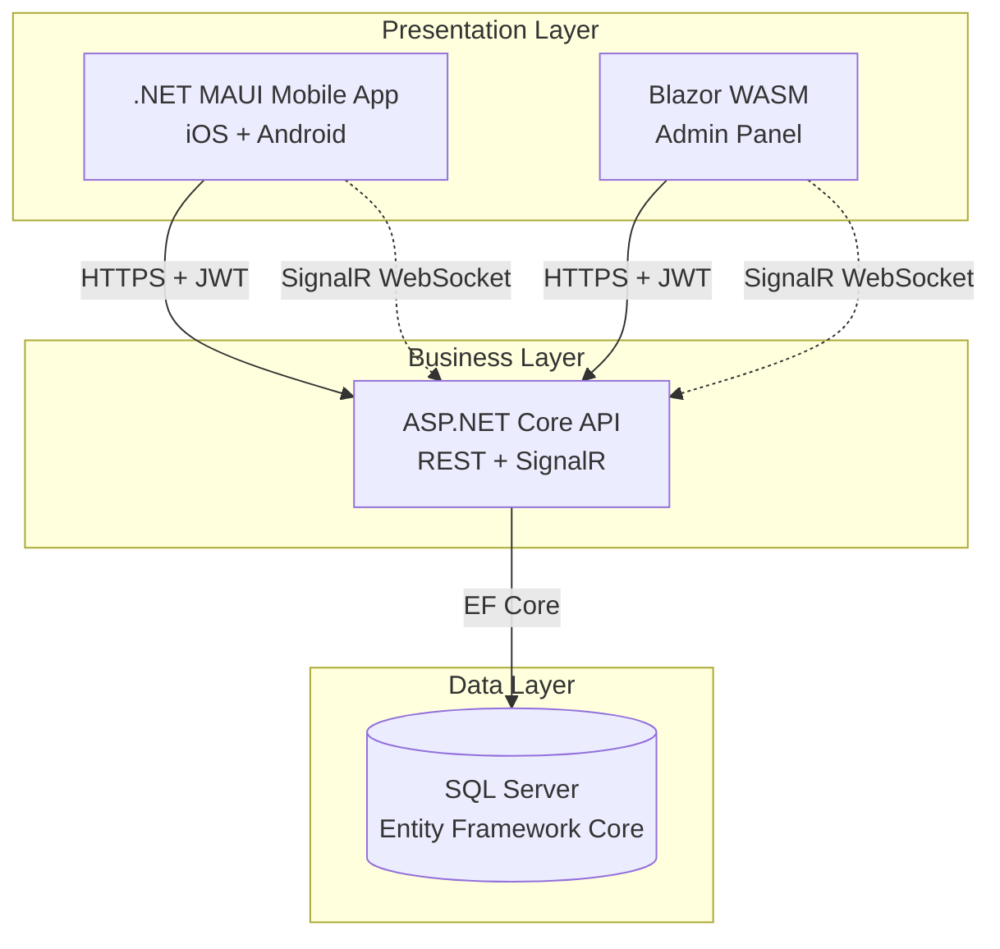
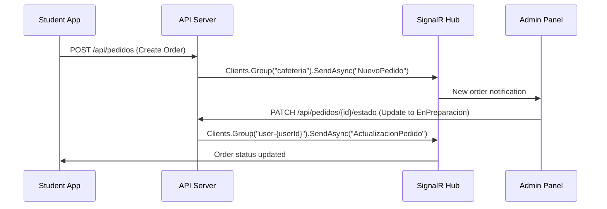
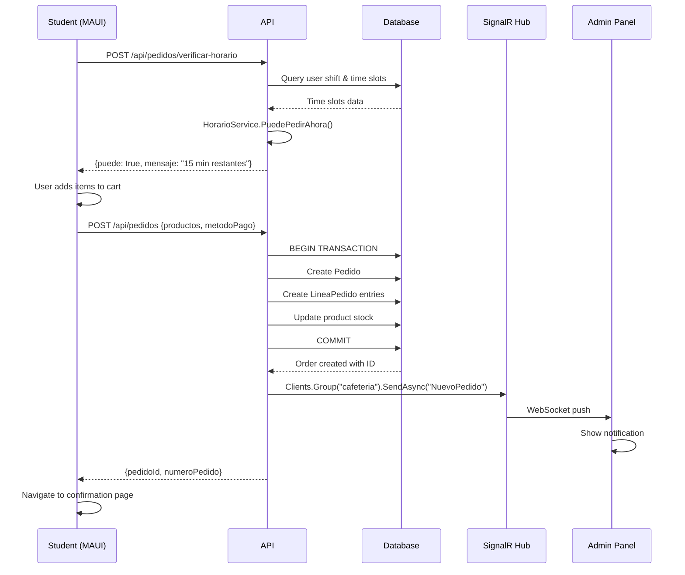
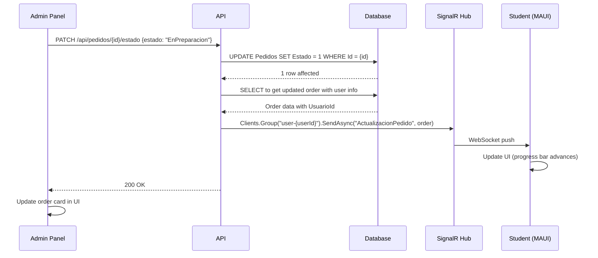

## Overview

CaféIES follows a modern three-tier architecture with clear separation of concerns:



## Project Structure

The solution is organized into four projects:

<CodeGroup>
```text Solution Structure
CafeIES/
├── CafeIES.Shared/          # Shared models and DTOs
│   └── Models/
│       ├── Entities.cs       # Database entities
│       ├── Enums.cs          # Enums (Turno, RolUsuario, etc.)
│       └── DTOs.cs           # Request/response DTOs
│
├── CafeIES.API/             # Backend API (ASP.NET Core 8)
│   ├── Controllers/         # REST API endpoints
│   ├── Services/            # Business logic
│   ├── Data/                # EF Core DbContext
│   ├── Hubs/                # SignalR hubs
│   └── Program.cs           # API configuration
│
├── CafeIES.MAUI/            # Mobile app (.NET MAUI)
│   ├── Views/               # XAML pages
│   ├── ViewModels/          # MVVM view models
│   ├── Services/            # API client + token storage
│   └── MauiProgram.cs       # App configuration
│
└── CafeIES.Admin/           # Admin panel (Blazor WASM)
    ├── Pages/               # Razor components
    ├── Services/            # API client
    └── wwwroot/             # Static assets
```
</CodeGroup>

## Shared Models Layer

The `CafeIES.Shared` project contains all data models used across the system, ensuring type safety and consistency.

### Core Entities

<AccordionGroup>
  <Accordion title="Usuario - User Entity" icon="user">
    Represents all users in the system (students, teachers, staff, admins).

    ```csharp CafeIES.Shared/Models/Entities.cs
    public class Usuario
    {
        public int Id { get; set; }
        public string NombreCompleto { get; set; }
        public string Email { get; set; }
        public string PasswordHash { get; set; }  // BCrypt hashed
        public RolUsuario Rol { get; set; }        // Alumno, Profesor, Personal, Admin
        public Turno? Turno { get; set; }          // Null for non-students
        public EstadoCuenta Estado { get; set; }   // PendienteValidacion, Activa, etc.
        public string? RefreshToken { get; set; }
        public DateTime? RefreshTokenExpiry { get; set; }
        
        // Navigation properties
        public ICollection<Pedido> Pedidos { get; set; }
    }
    ```

    **Key Points:**
    - Passwords stored as BCrypt hashes (never plain text)
    - JWT refresh tokens stored for seamless re-authentication
    - `Turno` is nullable - only students have assigned shifts
    - Students start in `PendienteValidacion` state
  </Accordion>

  <Accordion title="FranjaHoraria - Time Slot Entity" icon="clock">
    Defines when each shift can place orders. Fully configurable from admin panel.

    ```csharp CafeIES.Shared/Models/Entities.cs
    public class FranjaHoraria
    {
        public int Id { get; set; }
        public Turno Turno { get; set; }           // Manana, Tarde, Noche
        public string Descripcion { get; set; }     // "Recreo", "Antes de entrar"
        public string HoraInicio { get; set; }      // "11:00"
        public string HoraFin { get; set; }         // "11:30"
        public bool Activa { get; set; }
        
        [NotMapped]
        public bool EstaActiva
        {
            get
            {
                if (!Activa) return false;
                var ahora = TimeOnly.FromDateTime(DateTime.Now);
                var inicio = TimeOnly.Parse(HoraInicio);
                var fin = TimeOnly.Parse(HoraFin);
                return ahora >= inicio && ahora <= fin;
            }
        }
    }
    ```

    **Key Points:**
    - Multiple time slots per shift (e.g., before school + break time)
    - `EstaActiva` computed property checks if current time is within the slot
    - Times stored as strings ("HH:mm" format) for easy admin editing
  </Accordion>

  <Accordion title="Producto - Product Entity" icon="utensils">
    Represents cafeteria products with stock control.

    ```csharp CafeIES.Shared/Models/Entities.cs
    public class Producto
    {
        public int Id { get; set; }
        public string Nombre { get; set; }
        public string Descripcion { get; set; }
        public decimal Precio { get; set; }
        public int Stock { get; set; }              // -1 = unlimited
        public string? ImagenUrl { get; set; }
        public bool Activo { get; set; }
        public int CategoriaId { get; set; }
        public Categoria Categoria { get; set; }
        
        [NotMapped]
        public string NivelStock => Stock switch
        {
            -1 => "ok",
            0  => "agotado",
            <= 5 => "bajo",
            _  => "ok"
        };
    }
    ```

    **Key Points:**
    - Stock tracking: -1 means no stock control (unlimited)
    - `NivelStock` computed property for UI indicators
    - Soft delete via `Activo` flag instead of hard delete
  </Accordion>

  <Accordion title="Pedido - Order Entity" icon="receipt">
    Represents a customer order with multiple line items.

    ```csharp CafeIES.Shared/Models/Entities.cs
    public class Pedido
    {
        public int Id { get; set; }
        public int NumeroPedido { get; set; }       // Display number like #042
        public int UsuarioId { get; set; }
        public Usuario Usuario { get; set; }
        public DateTime FechaCreacion { get; set; }
        public EstadoPedido Estado { get; set; }    // Pendiente, EnPreparacion, etc.
        public MetodoPago MetodoPago { get; set; }
        public decimal Total { get; set; }
        public string? Notas { get; set; }
        public string? ReferenciasPago { get; set; }
        
        public ICollection<LineaPedido> Lineas { get; set; }
    }
    
    public class LineaPedido
    {
        public int Id { get; set; }
        public int PedidoId { get; set; }
        public int ProductoId { get; set; }
        public int Cantidad { get; set; }
        public decimal PrecioUnitario { get; set; }  // Price snapshot at order time
        
        [NotMapped]
        public decimal Subtotal => Cantidad * PrecioUnitario;
    }
    ```

    **Key Points:**
    - `NumeroPedido` is user-facing (e.g., #042), `Id` is internal
    - `PrecioUnitario` captures price at order time (won't change if product price changes)
    - Order lifecycle: Pendiente → EnPreparacion → Listo → Entregado
  </Accordion>
</AccordionGroup>

### Enumerations

```csharp CafeIES.Shared/Models/Enums.cs
public enum Turno { Manana = 0, Tarde = 1, Noche = 2 }

public enum RolUsuario { Alumno = 0, Profesor = 1, Personal = 2, Admin = 99 }

public enum EstadoCuenta { PendienteValidacion = 0, Activa = 1, Suspendida = 2, Rechazada = 3 }

public enum EstadoPedido { Pendiente = 0, EnPreparacion = 1, Listo = 2, Entregado = 3, Cancelado = 4 }

public enum MetodoPago { Tarjeta = 0, GooglePay = 1, ApplePay = 2 }
```

## API Layer (CafeIES.API)

### Technology Stack

- **ASP.NET Core 8**: Modern web framework
- **Entity Framework Core**: ORM for database access
- **SQL Server**: Relational database
- **JWT Bearer**: Stateless authentication
- **SignalR**: Real-time bi-directional communication
- **Swagger/OpenAPI**: API documentation

### Program.cs - API Configuration

The API bootstraps with comprehensive middleware:

```csharp CafeIES.API/Program.cs
var builder = WebApplication.CreateBuilder(args);

// Database with SQL Server
builder.Services.AddDbContext<AppDbContext>(opt =>
    opt.UseSqlServer(builder.Configuration.GetConnectionString("DefaultConnection")));

// Business services
builder.Services.AddScoped<AuthService>();
builder.Services.AddScoped<HorarioService>();

// JWT Authentication
var jwtKey = builder.Configuration["Jwt:Key"]!;
builder.Services.AddAuthentication(JwtBearerDefaults.AuthenticationScheme)
    .AddJwtBearer(opt => {
        opt.TokenValidationParameters = new TokenValidationParameters {
            ValidateIssuerSigningKey = true,
            IssuerSigningKey = new SymmetricSecurityKey(Encoding.UTF8.GetBytes(jwtKey)),
            // ... validation settings
        };
        
        // SignalR token from query string
        opt.Events = new JwtBearerEvents {
            OnMessageReceived = ctx => {
                var token = ctx.Request.Query["access_token"];
                if (!string.IsNullOrEmpty(token) && 
                    ctx.HttpContext.Request.Path.StartsWithSegments("/hubs"))
                    ctx.Token = token;
                return Task.CompletedTask;
            }
        };
    });

// SignalR for real-time
builder.Services.AddSignalR();

// CORS for Blazor admin panel
builder.Services.AddCors(opt =>
    opt.AddPolicy("AllowAdmin", p =>
        p.SetIsOriginAllowed(origin => origin.StartsWith("https://localhost"))
         .AllowAnyHeader()
         .AllowAnyMethod()
         .AllowCredentials()));
```

<Note>
  The API automatically applies migrations and seeds the admin user on startup (Program.cs:92-109). This means the database is always up-to-date!
</Note>

### Controllers

RESTful endpoints organized by domain:

<CardGroup cols={2}>
  <Card title="AuthController" icon="key">
    - `POST /api/auth/login` - Login with JWT
    - `POST /api/auth/registro-alumno` - Student self-registration
    - `POST /api/auth/registro-invitacion` - Register via QR code
    - `POST /api/auth/refresh` - Refresh JWT token
  </Card>
  
  <Card title="ProductosController" icon="utensils">
    - `GET /api/productos` - List all active products
    - `POST /api/productos` - Create product (admin)
    - `PUT /api/productos/{id}` - Update product (admin)
    - `PATCH /api/productos/{id}/stock` - Update stock (admin)
  </Card>
  
  <Card title="PedidosController" icon="receipt">
    - `GET /api/pedidos/mis-pedidos` - User's order history
    - `POST /api/pedidos` - Create new order
    - `GET /api/pedidos/{id}` - Order details
    - `PATCH /api/pedidos/{id}/estado` - Update status (admin)
  </Card>
  
  <Card title="AdminController" icon="shield">
    - `GET /api/admin/dashboard` - Statistics
    - `GET /api/admin/usuarios` - List all users
    - `POST /api/admin/usuarios/{id}/validar` - Approve student
    - `POST /api/admin/usuarios/{id}/rechazar` - Reject student
  </Card>
</CardGroup>

### HorarioService - Time Restriction Logic

The heart of the shift-based ordering system:

```csharp CafeIES.API/Services/HorarioService.cs
public class HorarioService
{
    private readonly AppDbContext _db;
    
    public async Task<HorarioResult> PuedePedirAhoraAsync(int usuarioId)
    {
        var usuario = await _db.Usuarios.FindAsync(usuarioId);
        if (usuario is null)
            return HorarioResult.Error("Usuario no encontrado.");
        
        // Admin, Profesor, Personal: no restrictions
        if (usuario.Rol != RolUsuario.Alumno)
            return HorarioResult.Permitido("Sin restricción horaria.");
        
        // Students must have a shift assigned
        if (usuario.Turno is null)
            return HorarioResult.Denegado("Tu cuenta no tiene turno asignado.");
        
        // Load active time slots for student's shift
        var franjas = await _db.FranjasHorarias
            .Where(f => f.Turno == usuario.Turno && f.Activa)
            .ToListAsync();
        
        // Check if any slot is currently active
        var franjaActiva = franjas.FirstOrDefault(f => f.EstaActiva);
        if (franjaActiva is not null)
        {
            var minutosRestantes = CalcularMinutosRestantes(franjaActiva);
            return HorarioResult.Permitido(
                $"Pedidos disponibles hasta las {franjaActiva.HoraFin} ({minutosRestantes} min restantes).",
                franjaActiva);
        }
        
        // No active slot - find next one
        var proxima = ObtenerProximaFranja(franjas);
        if (proxima is null)
            return HorarioResult.Denegado("No hay más franjas horarias hoy.");
        
        return HorarioResult.Denegado(
            $"Próxima ventana: {proxima.Descripcion} a las {proxima.HoraInicio}.",
            proxima);
    }
}
```

**How it works:**
1. Fetch user and check role
2. Non-students bypass time checks
3. Load all active time slots for student's shift
4. Check if current time falls within any slot using `FranjaHoraria.EstaActiva`
5. If yes: allow order and show remaining time
6. If no: deny and show next available slot

<Tip>
  This design means **zero code changes** to modify ordering hours - admins just edit the time slots in the database through the admin panel!
</Tip>

### SignalR Hub - Real-Time Communication

```csharp CafeIES.API/Hubs/CafeteriaHub.cs
[Authorize]
public class CafeteriaHub : Hub
{
    public override async Task OnConnectedAsync()
    {
        var user = Context.User!;
        
        // Cafeteria staff join "cafeteria" group
        if (user.IsInRole("Admin") || user.IsInRole("Personal"))
            await Groups.AddToGroupAsync(Context.ConnectionId, "cafeteria");
        
        // All users join their personal group for order updates
        var userId = user.FindFirst(ClaimTypes.NameIdentifier)?.Value;
        if (userId is not null)
            await Groups.AddToGroupAsync(Context.ConnectionId, $"user-{userId}");
        
        await base.OnConnectedAsync();
    }
}
```

**SignalR Groups:**
- `cafeteria`: All admin/staff - receive new orders
- `user-{userId}`: Individual users - receive their order updates

**Message Flow:**


## Mobile App Layer (CafeIES.MAUI)

### Architecture Pattern: MVVM

The mobile app follows the Model-View-ViewModel pattern:

```
View (XAML) ←→ ViewModel (C#) ←→ Service (API Client)
```

### Key Services

<Accordion title="ApiService - HTTP Client" icon="server">
  Handles all API communication:

  ```csharp CafeIES.MAUI/Services/ApiService.cs
  public class ApiService
  {
      private readonly HttpClient _http;
      private readonly TokenService _tokenService;
      
      public ApiService(HttpClient http, TokenService tokenService)
      {
          _http = http;
          _tokenService = tokenService;
      }
      
      private async Task<HttpClient> GetAuthenticatedClient()
      {
          var token = await _tokenService.GetTokenAsync();
          if (!string.IsNullOrEmpty(token))
              _http.DefaultRequestHeaders.Authorization = 
                  new AuthenticationHeaderValue("Bearer", token);
          return _http;
      }
      
      public async Task<List<ProductoDto>> ObtenerProductosAsync()
      {
          var client = await GetAuthenticatedClient();
          var response = await client.GetAsync("api/productos");
          response.EnsureSuccessStatusCode();
          return await response.Content.ReadFromJsonAsync<List<ProductoDto>>();
      }
      
      // ... more API methods
  }
  ```

  All API calls automatically include the JWT token from `TokenService`.
</Accordion>

<Accordion title="TokenService - Secure Storage" icon="key">
  Manages JWT tokens using platform-specific secure storage:

  ```csharp CafeIES.MAUI/Services/TokenService.cs
  public class TokenService
  {
      public async Task SaveTokenAsync(string token)
      {
          await SecureStorage.SetAsync("jwt_token", token);
      }
      
      public async Task<string?> GetTokenAsync()
      {
          return await SecureStorage.GetAsync("jwt_token");
      }
      
      public void RemoveToken()
      {
          SecureStorage.Remove("jwt_token");
      }
  }
  ```

  **Platform Implementation:**
  - iOS: Keychain
  - Android: EncryptedSharedPreferences
</Accordion>

### Dependency Injection Setup

```csharp CafeIES.MAUI/MauiProgram.cs
public static class MauiProgram
{
    public static MauiApp CreateMauiApp()
    {
        var builder = MauiApp.CreateBuilder();
        
        // HTTP Client with base address
        builder.Services.AddHttpClient<ApiService>(client => {
            client.BaseAddress = new Uri("https://10.0.2.2:50658/");
        });
        
        // Singleton services (live for app lifetime)
        builder.Services.AddSingleton<TokenService>();
        builder.Services.AddSingleton<CarritoViewModel>();  // Shared cart
        
        // Transient ViewModels (new instance per page)
        builder.Services.AddTransient<LoginViewModel>();
        builder.Services.AddTransient<HomeViewModel>();
        builder.Services.AddTransient<PedidosViewModel>();
        
        // Register all pages
        builder.Services.AddTransient<LoginPage>();
        builder.Services.AddTransient<HomePage>();
        builder.Services.AddTransient<PedidosPage>();
        
        return builder.Build();
    }
}
```

## Admin Panel Layer (CafeIES.Admin)

### Blazor WebAssembly

The admin panel runs entirely in the browser:
- Downloaded once and cached
- No server-side rendering
- Direct API calls to CafeIES.API

### Component Structure

```
Pages/
├── Login.razor              # Admin login
├── Dashboard.razor          # Real-time order monitoring
├── Productos.razor          # Product CRUD
├── Usuarios.razor           # User management
├── Invitaciones.razor       # QR code generation
└── Horarios.razor           # Time slot configuration
```

Each page is a self-contained Blazor component with:
- UI markup (HTML/Razor syntax)
- Component logic (@code block)
- Service injection for API calls

### Example: Dashboard with SignalR

```razor CafeIES.Admin/Pages/Dashboard.razor
@page "/dashboard"
@inject AdminApiService ApiService
@inject NavigationManager Navigation
@implements IAsyncDisposable

<h1>Dashboard</h1>

<div class="stats-grid">
    <div class="stat-card">
        <h3>@pedidosHoy</h3>
        <p>Pedidos Hoy</p>
    </div>
    <div class="stat-card">
        <h3>@totalHoy.ToString("C")</h3>
        <p>Ingresos Hoy</p>
    </div>
</div>

<h2>Pedidos en Curso</h2>
<div class="orders-list">
    @foreach (var pedido in pedidosActivos)
    {
        <div class="order-card">
            <span class="order-number">#@pedido.NumeroPedido</span>
            <span>@pedido.Usuario.NombreCompleto</span>
            <span>@pedido.Estado</span>
            <button @onclick="() => CambiarEstado(pedido.Id)">Siguiente Estado</button>
        </div>
    }
</div>

@code {
    private int pedidosHoy;
    private decimal totalHoy;
    private List<PedidoDto> pedidosActivos = new();
    private HubConnection? hubConnection;
    
    protected override async Task OnInitializedAsync()
    {
        await CargarDashboard();
        await ConectarSignalR();
    }
    
    private async Task ConectarSignalR()
    {
        hubConnection = new HubConnectionBuilder()
            .WithUrl("https://localhost:7001/hubs/cafeteria", options => {
                options.AccessTokenProvider = async () => await ObtenerToken();
            })
            .Build();
        
        hubConnection.On<PedidoDto>("NuevoPedido", pedido => {
            pedidosActivos.Add(pedido);
            pedidosHoy++;
            StateHasChanged();  // Re-render UI
        });
        
        await hubConnection.StartAsync();
    }
    
    public async ValueTask DisposeAsync()
    {
        if (hubConnection is not null)
            await hubConnection.DisposeAsync();
    }
}
```

## Data Flow Diagrams

### Student Orders a Product



### Admin Updates Order Status



## Database Schema

<Accordion title="Entity Relationship Diagram">
  ```mermaid
  erDiagram
      Usuario ||--o{ Pedido : places
      Usuario {
          int Id PK
          string NombreCompleto
          string Email UK
          string PasswordHash
          int Rol
          int Turno
          int Estado
          string RefreshToken
      }
      
      Pedido ||--|{ LineaPedido : contains
      Pedido {
          int Id PK
          int NumeroPedido
          int UsuarioId FK
          datetime FechaCreacion
          int Estado
          int MetodoPago
          decimal Total
      }
      
      Producto ||--o{ LineaPedido : ordered
      Producto {
          int Id PK
          string Nombre
          decimal Precio
          int Stock
          int CategoriaId FK
          bool Activo
      }
      
      Categoria ||--|{ Producto : contains
      Categoria {
          int Id PK
          string Nombre
          string Emoji
          int Orden
      }
      
      LineaPedido {
          int Id PK
          int PedidoId FK
          int ProductoId FK
          int Cantidad
          decimal PrecioUnitario
      }
      
      FranjaHoraria {
          int Id PK
          int Turno
          string Descripcion
          string HoraInicio
          string HoraFin
          bool Activa
      }
      
      Invitacion {
          int Id PK
          string Token UK
          int Tipo
          bool Activa
          datetime FechaExpiracion
      }
  ```
</Accordion>

## Security Architecture

### Authentication Flow

<Steps>
  <Step title="User Login">
    User submits email + password to `POST /api/auth/login`
  </Step>
  
  <Step title="Password Verification">
    API verifies BCrypt hash using `AuthService.VerificarPassword()`
  </Step>
  
  <Step title="JWT Generation">
    API generates two tokens:
    - **Access Token**: Short-lived (60 min), contains user claims
    - **Refresh Token**: Long-lived (7 days), stored in database
  </Step>
  
  <Step title="Token Storage">
    Client stores tokens securely:
    - MAUI: Platform-specific secure storage (Keychain/Encrypted Preferences)
    - Blazor: SessionStorage
  </Step>
  
  <Step title="Authenticated Requests">
    Client includes access token in `Authorization: Bearer {token}` header
  </Step>
  
  <Step title="Token Expiration">
    When access token expires, client calls `POST /api/auth/refresh` with refresh token to get new access token without re-login
  </Step>
</Steps>

### Authorization Policies

Role-based authorization using JWT claims:

```csharp
[Authorize(Roles = "Admin")]           // Admin only
[Authorize(Roles = "Admin,Personal")]  // Admin or Staff
[Authorize]                            // Any authenticated user
```

## Performance Considerations

### Database Optimizations

<CardGroup cols={2}>
  <Card title="Indexes" icon="gauge-high">
    - `Usuario.Email` (unique)
    - `Pedido.UsuarioId + FechaCreacion` (composite)
    - `Invitacion.Token` (unique)
  </Card>
  
  <Card title="Query Patterns" icon="magnifying-glass">
    - Include navigation properties: `.Include(p => p.Lineas).ThenInclude(l => l.Producto)`
    - Projection for DTOs: `Select(p => new ProductoDto { ... })`
    - Pagination for large lists
  </Card>
</CardGroup>

### SignalR Scalability

<Warning>
  Current implementation uses in-memory SignalR, which only works with a single API instance. For production with multiple servers, use:
  - Azure SignalR Service
  - Redis backplane
</Warning>

## Extension Points

### Adding New Features

<AccordionGroup>
  <Accordion title="New Product Field" icon="plus">
    1. Add property to `Producto` entity in `CafeIES.Shared/Models/Entities.cs`
    2. Create EF migration: `dotnet ef migrations add AddProductField`
    3. Update `ProductoDto` in `DTOs.cs`
    4. Update controllers, ViewModels, and UI
  </Accordion>
  
  <Accordion title="New Order Status" icon="list-check">
    1. Add enum value to `EstadoPedido` in `Enums.cs`
    2. Update UI status displays in MAUI and Blazor
    3. Update SignalR notifications
    4. No database migration needed (enums stored as int)
  </Accordion>
  
  <Accordion title="Payment Gateway Integration" icon="credit-card">
    1. Create `PaymentService` in `CafeIES.API/Services/`
    2. Add payment provider SDK via NuGet
    3. Update `PedidosController.CrearPedido()` to:
       - Call payment gateway before creating order
       - Store payment reference in `Pedido.ReferenciasPago`
    4. Handle webhooks for payment status updates
  </Accordion>
</AccordionGroup>

## Testing Strategy

### Recommended Test Coverage

<CardGroup cols={2}>
  <Card title="Unit Tests" icon="flask">
    - `HorarioService.PuedePedirAhoraAsync()`
    - `AuthService` password hashing
    - ViewModel business logic
    - DTO mappings
  </Card>
  
  <Card title="Integration Tests" icon="plug">
    - API endpoints with test database
    - EF Core queries and migrations
    - SignalR hub connections
  </Card>
  
  <Card title="E2E Tests" icon="mobile-screen">
    - Complete order flow
    - User registration and validation
    - Admin dashboard operations
  </Card>
  
  <Card title="Manual Testing" icon="hand-pointer">
    - Mobile UI on real devices
    - Time slot restrictions at actual times
    - Real-time updates across clients
  </Card>
</CardGroup>

## Deployment Architecture

For production deployment:

```
┌─────────────────┐
│  Azure App      │
│  Service        │  ← CafeIES.API
│  (Linux)        │
└────────┬────────┘
         │
         ├─────→ Azure SQL Database
         │
         └─────→ Azure SignalR Service

┌─────────────────┐
│  Azure Static   │
│  Web Apps       │  ← CafeIES.Admin (Blazor WASM)
└─────────────────┘

┌─────────────────┐
│  App Store      │  ← CafeIES.MAUI (iOS)
│  Google Play    │  ← CafeIES.MAUI (Android)
└─────────────────┘
```

<Note>
  See the [Deployment Guide](/guides/deployment/requirements) for detailed production setup instructions.
</Note>