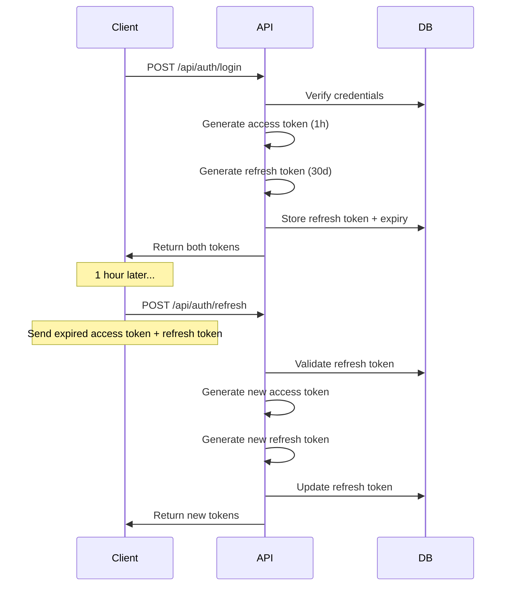

CaféIES uses JWT (JSON Web Tokens) for authentication with bcrypt password hashing. The system supports access tokens (short-lived) and refresh tokens (long-lived) for secure session management.

## JWT Configuration

### Settings Overview

JWT settings are configured in `appsettings.json`:

```json appsettings.json
{
  "Jwt": {
    "Key":      "CAMBIA_ESTA_CLAVE_POR_UNA_DE_AL_MENOS_32_CARACTERES!",
    "Issuer":   "CafeIES.API",
    "Audience": "CafeIES.App"
  }
}
```

<Warning>
  **CRITICAL**: Change the default JWT key before deploying to production! The key must be at least 32 characters long.
</Warning>

### Generating a Secure JWT Key

<CodeGroup>

```bash PowerShell
# Generate a random 64-character key
-join ((65..90) + (97..122) + (48..57) | Get-Random -Count 64 | ForEach-Object {[char]$_})
```

```bash Linux/macOS
# Generate a random 64-character key
openssl rand -base64 48
```

```csharp C# (programmatic)
// Generate in code
using System.Security.Cryptography;
var key = Convert.ToBase64String(RandomNumberGenerator.GetBytes(64));
Console.WriteLine(key);
```

</CodeGroup>

### Environment Variables (Production)

For production, use environment variables instead of `appsettings.json`:

```bash
export Jwt__Key="your-generated-key-here"
export Jwt__Issuer="CafeIES.API"
export Jwt__Audience="CafeIES.App"
```

<Note>
  Notice the double underscore `__` syntax for nested configuration in environment variables.
</Note>

## JWT Setup in Program.cs

The API configures JWT authentication with custom validation parameters:

```csharp Program.cs:21
var jwtKey = builder.Configuration["Jwt:Key"]!;
builder.Services.AddAuthentication(JwtBearerDefaults.AuthenticationScheme)
    .AddJwtBearer(opt =>
    {
        opt.TokenValidationParameters = new TokenValidationParameters
        {
            ValidateIssuer           = true,
            ValidateAudience         = true,
            ValidateLifetime         = true,
            ValidateIssuerSigningKey = true,
            ValidIssuer              = builder.Configuration["Jwt:Issuer"],
            ValidAudience            = builder.Configuration["Jwt:Audience"],
            IssuerSigningKey         = new SymmetricSecurityKey(Encoding.UTF8.GetBytes(jwtKey))
        };

        // SignalR requires token via query string
        opt.Events = new JwtBearerEvents
        {
            OnMessageReceived = ctx =>
            {
                var token = ctx.Request.Query["access_token"];
                if (!string.IsNullOrEmpty(token) &&
                    ctx.HttpContext.Request.Path.StartsWithSegments("/hubs"))
                    ctx.Token = token;
                return Task.CompletedTask;
            }
        };
    });
```

### Key Features

- **Issuer/Audience validation**: Prevents tokens from other systems being accepted
- **Lifetime validation**: Expired tokens are automatically rejected
- **SignalR support**: Allows WebSocket connections to authenticate via query string parameter

## AuthService Implementation

The `AuthService` class handles all authentication operations:

```csharp Services/AuthService.cs
public class AuthService
{
    private readonly IConfiguration _config;

    public AuthService(IConfiguration config)
    {
        _config = config;
    }

    /// <summary>Generate a short-lived access token (1 hour)</summary>
    public string GenerarAccessToken(Usuario usuario)
    {
        var key = new SymmetricSecurityKey(
            Encoding.UTF8.GetBytes(_config["Jwt:Key"]!));

        var claims = new[]
        {
            new Claim(ClaimTypes.NameIdentifier, usuario.Id.ToString()),
            new Claim(ClaimTypes.Email,          usuario.Email),
            new Claim(ClaimTypes.Name,           usuario.NombreCompleto),
            new Claim(ClaimTypes.Role,           usuario.Rol.ToString()),
            new Claim("turno",                   usuario.Turno?.ToString() ?? ""),
            new Claim("estado",                  usuario.Estado.ToString())
        };

        var token = new JwtSecurityToken(
            issuer:   _config["Jwt:Issuer"],
            audience: _config["Jwt:Audience"],
            claims:   claims,
            expires:  DateTime.UtcNow.AddHours(1),
            signingCredentials: new SigningCredentials(key, SecurityAlgorithms.HmacSha256)
        );

        return new JwtSecurityTokenHandler().WriteToken(token);
    }

    /// <summary>Generate a secure refresh token (30 days)</summary>
    public string GenerarRefreshToken()
    {
        var bytes = new byte[64];
        using var rng = RandomNumberGenerator.Create();
        rng.GetBytes(bytes);
        return Convert.ToBase64String(bytes);
    }

    /// <summary>Verify password against bcrypt hash</summary>
    public bool VerificarPassword(string password, string hash)
        => BCrypt.Net.BCrypt.Verify(password, hash);

    /// <summary>Generate bcrypt hash for a password</summary>
    public string HashPassword(string password)
        => BCrypt.Net.BCrypt.HashPassword(password, workFactor: 12);
}
```

### Token Claims

Each access token contains the following claims:

| Claim Type | Description | Example |
|------------|-------------|----------|
| `NameIdentifier` | User ID | `"42"` |
| `Email` | User email | `"student@ies.es"` |
| `Name` | Full name | `"Juan Pérez"` |
| `Role` | User role | `"Alumno"`, `"Admin"`, etc. |
| `turno` | Student shift | `"Manana"`, `"Tarde"`, `"Noche"` |
| `estado` | Account status | `"Activa"`, `"Suspendida"`, etc. |

### Token Lifetimes

<CardGroup cols={2}>
  <Card title="Access Token" icon="clock">
    **1 hour**
    
    Short-lived for security. Client must refresh when expired.
  </Card>
  <Card title="Refresh Token" icon="rotate">
    **30 days**
    
    Stored in database. Used to obtain new access tokens.
  </Card>
</CardGroup>

## Password Hashing (bcrypt)

CaféIES uses bcrypt with a work factor of 12 for password hashing:

```csharp Services/AuthService.cs:60
public string HashPassword(string password)
    => BCrypt.Net.BCrypt.HashPassword(password, workFactor: 12);

public bool VerificarPassword(string password, string hash)
    => BCrypt.Net.BCrypt.Verify(password, hash);
```

### Why bcrypt?

<Steps>
  <Step title="Adaptive hashing">
    Work factor can be increased as hardware gets faster, making brute-force attacks increasingly expensive.
  </Step>
  <Step title="Automatic salting">
    Each password gets a unique random salt, preventing rainbow table attacks.
  </Step>
  <Step title="Industry standard">
    Widely tested and recommended by security experts (OWASP, NIST).
  </Step>
</Steps>

### Work Factor Guidelines

| Work Factor | Hashing Time | Security Level |
|-------------|--------------|----------------|
| 10 | ~100ms | Minimum acceptable |
| 12 | ~400ms | **Recommended (CaféIES default)** |
| 14 | ~1.6s | High security |
| 16 | ~6.4s | Maximum practical |

<Note>
  Work factor 12 provides a good balance between security and user experience. Increase to 14+ for high-security applications.
</Note>

## Refresh Token Mechanism

CaféIES implements a secure token refresh flow:



### Refresh Token Storage

Refresh tokens are stored in the `Usuario` table:

```csharp Controllers/AuthController.cs:38
var accessToken  = _auth.GenerarAccessToken(usuario);
var refreshToken = _auth.GenerarRefreshToken();

usuario.RefreshToken       = refreshToken;
usuario.RefreshTokenExpiry = DateTime.UtcNow.AddDays(30);
await _db.SaveChangesAsync();
```

### Refresh Endpoint

Clients can refresh their access token using the `/api/auth/refresh` endpoint:

```csharp Controllers/AuthController.cs:124
[HttpPost("refresh")]
public async Task<ActionResult<LoginResponse>> Refresh([FromBody] RefreshRequest req)
{
    var usuario = await _db.Usuarios
        .FirstOrDefaultAsync(u => u.RefreshToken == req.RefreshToken
                               && u.RefreshTokenExpiry > DateTime.UtcNow);

    if (usuario is null)
        return Unauthorized(new { mensaje = "Refresh token inválido o expirado." });

    var accessToken  = _auth.GenerarAccessToken(usuario);
    var refreshToken = _auth.GenerarRefreshToken();
    usuario.RefreshToken       = refreshToken;
    usuario.RefreshTokenExpiry = DateTime.UtcNow.AddDays(30);
    await _db.SaveChangesAsync();

    return Ok(new LoginResponse(accessToken, refreshToken, MapUsuarioDto(usuario)));
}
```

<Note>
  Each refresh generates a **new** refresh token (token rotation), invalidating the old one. This prevents replay attacks.
</Note>

## Authentication Flow

### Login Process

<Steps>
  <Step title="Client sends credentials">
    POST request to `/api/auth/login` with email and password.
  </Step>
  
  <Step title="Server validates password">
    ```csharp
    if (usuario is null || !_auth.VerificarPassword(req.Password, usuario.PasswordHash))
        return Unauthorized(new { mensaje = "Credenciales incorrectas." });
    ```
  </Step>
  
  <Step title="Check account status">
    ```csharp
    if (usuario.Estado == EstadoCuenta.PendienteValidacion)
        return Forbid(); // 403 - pending admin approval
    
    if (usuario.Estado == EstadoCuenta.Suspendida || usuario.Estado == EstadoCuenta.Rechazada)
        return Forbid(); // 403 - account disabled
    ```
  </Step>
  
  <Step title="Generate tokens">
    ```csharp
    var accessToken  = _auth.GenerarAccessToken(usuario);
    var refreshToken = _auth.GenerarRefreshToken();
    
    usuario.RefreshToken       = refreshToken;
    usuario.RefreshTokenExpiry = DateTime.UtcNow.AddDays(30);
    await _db.SaveChangesAsync();
    ```
  </Step>
  
  <Step title="Return tokens to client">
    ```json
    {
      "accessToken": "eyJhbGciOiJIUzI1NiIsInR5cCI6IkpXVCJ9...",
      "refreshToken": "a3V2Wm9rR05HQjZxTnlZaG5BZ0ZRdz09",
      "usuario": {
        "id": 42,
        "nombre": "Juan Pérez",
        "rol": "Alumno"
      }
    }
    ```
  </Step>
</Steps>

### Registration Flows

CaféIES supports two registration types:

<Tabs>
  <Tab title="Student (Alumno)">
    Students register freely but require admin approval:

    ```csharp Controllers/AuthController.cs:52
    [HttpPost("registro/alumno")]
    public async Task<ActionResult> RegistroAlumno([FromBody] RegistroAlumnoRequest req)
    {
        if (await _db.Usuarios.AnyAsync(u => u.Email == req.Email.ToLower()))
            return Conflict(new { mensaje = "Ya existe una cuenta con ese email." });

        var usuario = new Usuario
        {
            NombreCompleto = req.NombreCompleto,
            Email          = req.Email.ToLower(),
            PasswordHash   = _auth.HashPassword(req.Password),
            Rol            = RolUsuario.Alumno,
            Turno          = req.Turno,
            Estado         = EstadoCuenta.PendienteValidacion  // ⚠️ Needs approval
        };

        _db.Usuarios.Add(usuario);
        await _db.SaveChangesAsync();

        return Ok(new { mensaje = "Registro completado. Tu cuenta está pendiente de validación por el administrador." });
    }
    ```

    <Warning>
      Students cannot login until an admin approves their account via the admin panel.
    </Warning>
  </Tab>

  <Tab title="Teacher/Staff (Invitation)">
    Teachers and staff register via invitation tokens:

    ```csharp Controllers/AuthController.cs:75
    [HttpPost("registro/invitacion")]
    public async Task<ActionResult<LoginResponse>> RegistroInvitado([FromBody] RegistroInvitadoRequest req)
    {
        // Validate invitation token
        var invitacion = await _db.Invitaciones
            .FirstOrDefaultAsync(i => i.Token == req.TokenInvitacion);

        if (invitacion is null || !invitacion.EsValida)
            return BadRequest(new { mensaje = "El enlace de invitación no es válido o ha expirado." });

        // Assign role based on invitation type
        var rol = invitacion.Tipo == TipoInvitacion.Profesor
            ? RolUsuario.Profesor
            : RolUsuario.Personal;

        var usuario = new Usuario
        {
            NombreCompleto  = req.NombreCompleto,
            Email           = req.Email.ToLower(),
            PasswordHash    = _auth.HashPassword(req.Password),
            Rol             = rol,
            Turno           = null,  // No time restrictions
            Estado          = EstadoCuenta.Activa,  // ✅ Immediately active
            FechaValidacion = DateTime.UtcNow
        };

        _db.Usuarios.Add(usuario);

        // Increment invitation usage
        invitacion.UsosActuales++;
        if (invitacion.UsosMaximos.HasValue && invitacion.UsosActuales >= invitacion.UsosMaximos)
            invitacion.Activa = false;

        await _db.SaveChangesAsync();

        // Auto-login after registration
        var accessToken  = _auth.GenerarAccessToken(usuario);
        var refreshToken = _auth.GenerarRefreshToken();
        usuario.RefreshToken       = refreshToken;
        usuario.RefreshTokenExpiry = DateTime.UtcNow.AddDays(30);
        await _db.SaveChangesAsync();

        return Ok(new LoginResponse(accessToken, refreshToken, MapUsuarioDto(usuario)));
    }
    ```

    <Note>
      Invitation-based registration grants immediate access without admin approval.
    </Note>
  </Tab>
</Tabs>

## Protecting API Endpoints

### Role-Based Authorization

Use `[Authorize]` attributes to protect controllers and endpoints:

```csharp
// Require any authenticated user
[Authorize]
public class PedidosController : ControllerBase { }

// Require specific role
[Authorize(Roles = "Admin")]
public class AdminController : ControllerBase { }

// Allow multiple roles
[Authorize(Roles = "Admin,Profesor,Personal")]
public class ReportesController : ControllerBase { }
```

### Accessing User Claims in Controllers

```csharp
public class PedidosController : ControllerBase
{
    [HttpGet("mis-pedidos")]
    public async Task<ActionResult> GetMisPedidos()
    {
        // Get user ID from JWT claims
        var userId = int.Parse(User.FindFirst(ClaimTypes.NameIdentifier)!.Value);
        
        // Get user role
        var role = User.FindFirst(ClaimTypes.Role)?.Value;
        
        // Check if user has specific claim
        if (User.IsInRole("Admin"))
        {
            // Admin logic
        }
        
        var pedidos = await _db.Pedidos
            .Where(p => p.UsuarioId == userId)
            .ToListAsync();
            
        return Ok(pedidos);
    }
}
```

## Security Best Practices

<CardGroup cols={2}>
  <Card title="Rotate JWT Keys" icon="rotate">
    Change JWT keys periodically (every 90 days) in production.
  </Card>
  
  <Card title="Use HTTPS" icon="lock">
    Always use HTTPS in production. Tokens sent over HTTP can be intercepted.
  </Card>
  
  <Card title="Short Access Tokens" icon="clock">
    Keep access tokens short-lived (1 hour). Use refresh tokens for long sessions.
  </Card>
  
  <Card title="Rate Limiting" icon="shield">
    Implement rate limiting on login endpoints to prevent brute-force attacks.
  </Card>
</CardGroup>

### Additional Recommendations

<Accordion title="Implement token revocation">
  Consider adding a token blacklist table to revoke tokens before expiration (e.g., on logout or password change).
</Accordion>

<Accordion title="Add multi-factor authentication (MFA)">
  For admin accounts, implement TOTP-based 2FA using a library like `GoogleAuthenticator`.
</Accordion>

<Accordion title="Log authentication events">
  Log all login attempts, failures, and token refreshes for security auditing.
</Accordion>

<Accordion title="Password complexity requirements">
  Enforce password rules in the client and API:
  - Minimum 8 characters
  - At least one uppercase, lowercase, number, and special character
  - Check against common password lists (e.g., `haveibeenpwned` API)
</Accordion>

## Related Pages

<CardGroup cols={2}>
  <Card title="Database Setup" icon="database" href="/configuration/database">
    Configure SQL Server and Entity Framework
  </Card>
  <Card title="Time Schedules" icon="clock" href="/configuration/time-schedules">
    Manage ordering windows for students
  </Card>
</CardGroup>