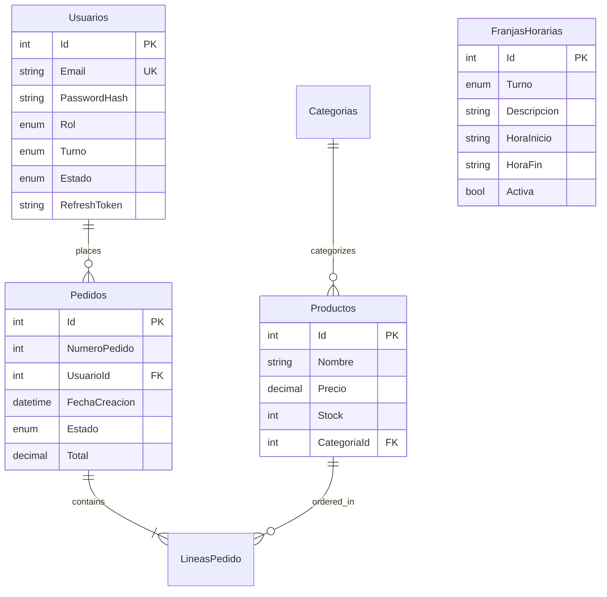

CaféIES uses SQL Server with Entity Framework Core for data persistence. The application automatically applies migrations and seeds initial data on startup.

## SQL Server Setup

### Prerequisites

Install SQL Server Express (recommended for development):

- **Windows**: Download [SQL Server Express](https://www.microsoft.com/sql-server/sql-server-downloads)
- **macOS/Linux**: Use Docker to run SQL Server in a container

<CodeGroup>

```bash Windows
# SQL Server Express installs with instance name SQLEXPRESS by default
# Connection: localhost\SQLEXPRESS
```

```bash Docker
docker run -e "ACCEPT_EULA=Y" -e "SA_PASSWORD=YourStrong@Password" \
  -p 1433:1433 --name sqlserver \
  -d mcr.microsoft.com/mssql/server:2022-latest
```

</CodeGroup>

## Connection String Configuration

The connection string is configured in `appsettings.json` in the API project:

```json appsettings.json
{
  "ConnectionStrings": {
    "DefaultConnection": "Server=localhost\\SQLEXPRESS;Database=CafeIES;Trusted_Connection=True;TrustServerCertificate=True;"
  }
}
```

### Connection String Options

<AccordionGroup>
  <Accordion title="Windows Authentication (Recommended for Development)">
    ```
    Server=localhost\SQLEXPRESS;Database=CafeIES;Trusted_Connection=True;TrustServerCertificate=True;
    ```
    Uses Windows credentials, no password needed.
  </Accordion>

  <Accordion title="SQL Server Authentication">
    ```
    Server=localhost;Database=CafeIES;User Id=sa;Password=YourPassword;TrustServerCertificate=True;
    ```
    Uses SQL Server username and password.
  </Accordion>

  <Accordion title="Docker / Remote Server">
    ```
    Server=your-server.com,1433;Database=CafeIES;User Id=sa;Password=YourPassword;TrustServerCertificate=True;
    ```
    Connect to a remote SQL Server instance.
  </Accordion>
</AccordionGroup>

<Warning>
  Always use environment variables or Azure Key Vault for production connection strings. Never commit credentials to source control.
</Warning>

## Database Context (AppDbContext)

The `AppDbContext` class defines all database tables and relationships:

```csharp Data/AppDbContext.cs
public class AppDbContext : DbContext
{
    public AppDbContext(DbContextOptions<AppDbContext> options) : base(options) { }

    // Tables
    public DbSet<Usuario>       Usuarios        => Set<Usuario>();
    public DbSet<FranjaHoraria> FranjasHorarias => Set<FranjaHoraria>();
    public DbSet<Invitacion>    Invitaciones    => Set<Invitacion>();
    public DbSet<Categoria>     Categorias      => Set<Categoria>();
    public DbSet<Producto>      Productos       => Set<Producto>();
    public DbSet<Pedido>        Pedidos         => Set<Pedido>();
    public DbSet<LineaPedido>   LineasPedido    => Set<LineaPedido>();
}
```

### Key Features

- **Unique constraints** on `Usuario.Email` and `Invitacion.Token`
- **Enum conversions** for `Rol`, `Estado`, `Turno`, `EstadoPedido`, `MetodoPago`
- **Cascade delete** on `LineaPedido` when parent `Pedido` is deleted
- **Restrict delete** on `Producto` and `Usuario` to prevent accidental data loss
- **Composite index** on `(UsuarioId, FechaCreacion)` for fast order queries

### Seed Data

The context seeds initial data for categories and time schedules:

```csharp Data/AppDbContext.cs:84
// Default categories
mb.Entity<Categoria>().HasData(
    new Categoria { Id = 1, Nombre = "Bocadillos",  Emoji = "🥖", Orden = 1 },
    new Categoria { Id = 2, Nombre = "Ensaladas",   Emoji = "🥗", Orden = 2 },
    new Categoria { Id = 3, Nombre = "Bebidas",     Emoji = "🥤", Orden = 3 },
    new Categoria { Id = 4, Nombre = "Postres",     Emoji = "🍰", Orden = 4 },
    new Categoria { Id = 5, Nombre = "Café",        Emoji = "☕", Orden = 5 }
);

// Default time windows (see time-schedules.mdx)
mb.Entity<FranjaHoraria>().HasData(
    new FranjaHoraria { Id = 1, Turno = Turno.Manana, Descripcion = "Antes de entrar", HoraInicio = "07:30", HoraFin = "08:00" },
    new FranjaHoraria { Id = 2, Turno = Turno.Manana, Descripcion = "Recreo",          HoraInicio = "11:00", HoraFin = "11:30" },
    // ... more entries
);
```

## Entity Framework Migrations

### Creating Migrations

When you modify entity models, create a new migration:

```bash
dotnet ef migrations add YourMigrationName --project CafeIES.API
```

### Applying Migrations

<Steps>
  <Step title="Automatic Migration on Startup (Recommended)">
    The API automatically applies pending migrations when it starts:

    ```csharp Program.cs:92
    using (var scope = app.Services.CreateScope())
    {
        var db = scope.ServiceProvider.GetRequiredService<AppDbContext>();
        
        try
        {
            await db.Database.MigrateAsync();          // Apply pending migrations
            await DbSeeder.SeedAdminAsync(db, config); // Seed admin account
        }
        catch (Exception ex)
        {
            logger.LogError(ex, "Could not connect to database on startup.");
            // App continues running, Swagger remains available
        }
    }
    ```

    <Note>
      If the database is unavailable, the API still starts and logs a warning. This allows you to check the connection string via Swagger.
    </Note>
  </Step>

  <Step title="Manual Migration (Production)">
    For production deployments, apply migrations manually before deploying:

    ```bash
    dotnet ef database update --project CafeIES.API
    ```
  </Step>
</Steps>

### Removing Migrations

If you need to undo the last migration:

```bash
# Remove the migration (only if not applied to database)
dotnet ef migrations remove --project CafeIES.API

# Revert the database to previous migration
dotnet ef database update PreviousMigrationName --project CafeIES.API
```

## Database Seeding (DbSeeder)

The `DbSeeder` class creates the initial admin account on first run:

```csharp Data/DbSeeder.cs
public static async Task SeedAdminAsync(AppDbContext db, IConfiguration config)
{
    // Only seed if no admin exists
    if (db.Usuarios.Any(u => u.Rol == RolUsuario.Admin)) return;

    var adminEmail    = config["Admin:Email"]    ?? "admin@cafeies.local";
    var adminPassword = config["Admin:Password"] ?? "Admin1234!";
    var adminNombre   = config["Admin:Nombre"]   ?? "Administrador";

    var admin = new Usuario
    {
        NombreCompleto  = adminNombre,
        Email           = adminEmail,
        PasswordHash    = BCrypt.Net.BCrypt.HashPassword(adminPassword),
        Rol             = RolUsuario.Admin,
        Turno           = null,  // No time restrictions
        Estado          = EstadoCuenta.Activa,
        FechaRegistro   = DateTime.UtcNow,
        FechaValidacion = DateTime.UtcNow
    };

    db.Usuarios.Add(admin);
    await db.SaveChangesAsync();
}
```

### Admin Credentials

Configure admin credentials in `appsettings.json`:

```json appsettings.json
{
  "Admin": {
    "Email":    "admin@cafeies.local",
    "Password": "Admin1234!",
    "Nombre":   "Administrador"
  }
}
```

<Warning>
  **Change the default admin password immediately after first login!** For production, use environment variables:
  
  ```bash
  export Admin__Password="YourSecurePassword123!"
  ```
</Warning>

## Database Schema

The database consists of 7 main tables:



## Troubleshooting

<AccordionGroup>
  <Accordion title="Connection Failed: SQL Server not found">
    **Symptoms**: `A network-related or instance-specific error occurred`

    **Solutions**:
    - Verify SQL Server is running: Open SQL Server Configuration Manager
    - Check instance name: Should be `SQLEXPRESS` for SQL Express
    - Enable TCP/IP protocol in SQL Server Configuration Manager
    - Restart SQL Server service
  </Accordion>

  <Accordion title="Login failed for user">
    **Symptoms**: `Cannot open database "CafeIES" requested by the login`

    **Solutions**:
    - Database doesn't exist yet - run the API once to auto-create it
    - Check SQL Server authentication mode (mixed mode required for SQL auth)
    - Verify user has `dbcreator` role if database doesn't exist
  </Accordion>

  <Accordion title="Migrations not applying">
    **Symptoms**: Tables missing or schema outdated

    **Solutions**:
    ```bash
    # Check migration status
    dotnet ef migrations list --project CafeIES.API
    
    # Apply all pending migrations
    dotnet ef database update --project CafeIES.API
    
    # If stuck, drop and recreate database
    dotnet ef database drop --project CafeIES.API
    dotnet ef database update --project CafeIES.API
    ```
  </Accordion>

  <Accordion title="Certificate validation errors">
    **Symptoms**: `The certificate chain was issued by an authority that is not trusted`

    **Solution**: Add `TrustServerCertificate=True` to your connection string (already included in default config)
  </Accordion>
</AccordionGroup>

## Related Pages

<CardGroup cols={2}>
  <Card title="Authentication" icon="key" href="/configuration/authentication">
    Configure JWT tokens and password hashing
  </Card>
  <Card title="Time Schedules" icon="clock" href="/configuration/time-schedules">
    Manage FranjaHoraria entries for student ordering windows
  </Card>
</CardGroup>