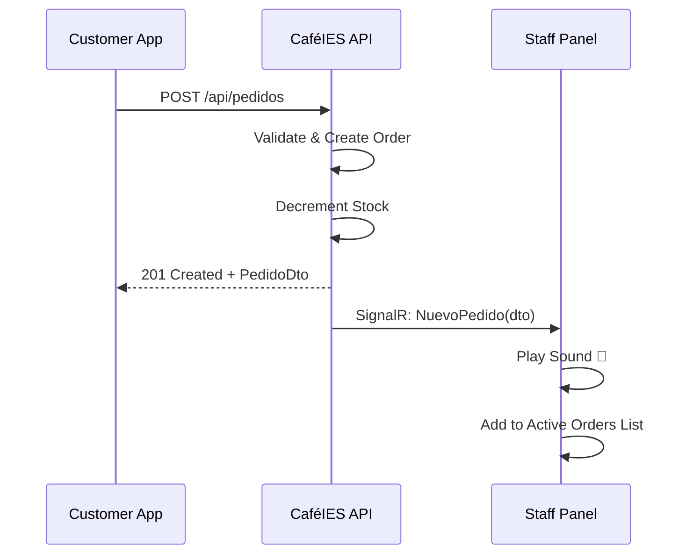
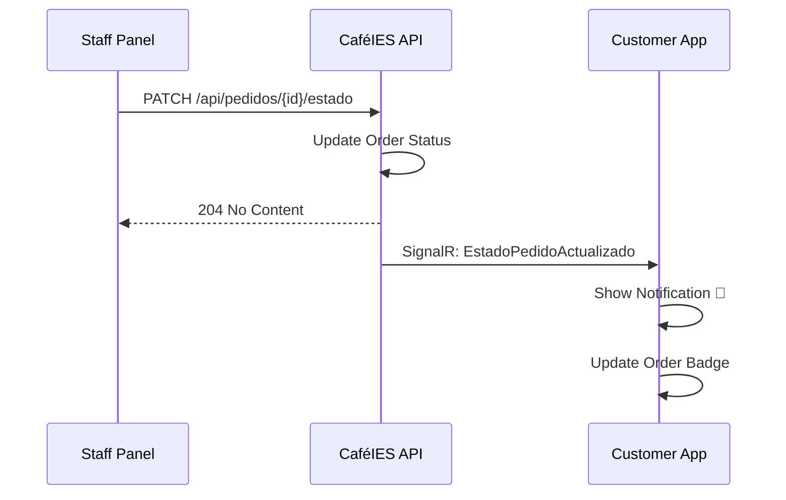

## Overview

CaféIES uses SignalR to deliver real-time bidirectional communication between the API, mobile app, and admin panel. This enables instant notifications when orders are placed or their status changes, without polling.

## SignalR Architecture

<CardGroup cols={2}>
  <Card title="Server Hub" icon="server">
    **CafeteriaHub**
    
    Central SignalR hub managing connections and message routing
  </Card>
  
  <Card title="Client Groups" icon="users">
    **Auto-Joining**
    
    - `cafeteria`: Staff/admins receive all new orders
    - `user-{id}`: Individual users get their order updates
  </Card>
</CardGroup>

## CafeteriaHub Implementation

The hub manages WebSocket connections and group assignments:

```csharp CafeIES.API/Hubs/CafeteriaHub.cs
using Microsoft.AspNetCore.Authorization;
using Microsoft.AspNetCore.SignalR;

namespace CafeIES.API.Hubs;

/// <summary>
/// Hub de SignalR para notificaciones en tiempo real.
/// 
/// Grupos:
///   "cafeteria"     → recibe todos los pedidos nuevos (panel de cafetería/admin)
///   "user-{userId}" → recibe actualizaciones del estado de sus pedidos (app MAUI)
/// </summary>
[Authorize]
public class CafeteriaHub : Hub
{
    public override async Task OnConnectedAsync()
    {
        var user = Context.User!;

        // El panel de cafetería/admin se une al grupo "cafeteria"
        if (user.IsInRole("Admin") || user.IsInRole("Personal"))
            await Groups.AddToGroupAsync(Context.ConnectionId, "cafeteria");

        // Todo usuario se une a su grupo personal para recibir updates de sus pedidos
        var userId = user.FindFirst(System.Security.Claims.ClaimTypes.NameIdentifier)?.Value;
        if (userId is not null)
            await Groups.AddToGroupAsync(Context.ConnectionId, $"user-{userId}");

        await base.OnConnectedAsync();
    }
}
```

<Note>
All connections require authentication via JWT. The hub automatically assigns users to appropriate groups based on their role.
</Note>

## Server Configuration

SignalR is configured in the API startup:

```csharp CafeIES.API/Program.cs
// ── JWT Authentication ────────────────────────────────────────────────────────
var jwtKey = builder.Configuration["Jwt:Key"]!;
builder.Services.AddAuthentication(JwtBearerDefaults.AuthenticationScheme)
    .AddJwtBearer(opt =>
    {
        opt.TokenValidationParameters = new TokenValidationParameters
        {
            ValidateIssuer           = true,
            ValidateAudience         = true,
            ValidateLifetime         = true,
            ValidateIssuerSigningKey = true,
            ValidIssuer              = builder.Configuration["Jwt:Issuer"],
            ValidAudience            = builder.Configuration["Jwt:Audience"],
            IssuerSigningKey         = new SymmetricSecurityKey(Encoding.UTF8.GetBytes(jwtKey))
        };

        // SignalR necesita el token por query string
        opt.Events = new JwtBearerEvents
        {
            OnMessageReceived = ctx =>
            {
                var token = ctx.Request.Query["access_token"];
                if (!string.IsNullOrEmpty(token) &&
                    ctx.HttpContext.Request.Path.StartsWithSegments("/hubs"))
                    ctx.Token = token;
                return Task.CompletedTask;
            }
        };
    });

// ── SignalR ───────────────────────────────────────────────────────────────────
builder.Services.AddSignalR();

// ── Map Hub ───────────────────────────────────────────────────────────────────
app.MapHub<CafeteriaHub>("/hubs/cafeteria");
```

<Accordion title="Why Query String Authentication?">
SignalR WebSocket connections cannot send custom headers like REST requests. The JWT token must be passed via query string parameter `access_token`:

```
wss://api.cafeies.com/hubs/cafeteria?access_token=eyJhbGc...
```

The `OnMessageReceived` event handler extracts this token and validates it.
</Accordion>

## Message Types

### 1. New Order Notification

When an order is created, cafeteria staff receive instant notification:

```csharp CafeIES.API/Controllers/PedidosController.cs
[HttpPost]
public async Task<ActionResult<PedidoDto>> Crear([FromBody] CrearPedidoRequest req)
{
    // ... order creation logic ...

    await _db.SaveChangesAsync();

    // 5. Notificar a la cafetería en tiempo real vía SignalR
    var dto = await GetPedidoDtoAsync(pedido.Id);
    await _hub.Clients.Group("cafeteria").SendAsync("NuevoPedido", dto);

    return CreatedAtAction(nameof(GetById), new { id = pedido.Id }, dto);
}
```

**Message Details:**
- **Method**: `NuevoPedido`
- **Target**: `cafeteria` group (all admins and staff)
- **Payload**: Full `PedidoDto` with order details

<CodeGroup>
```json Example Payload
{
  "Id": 142,
  "NumeroPedido": 23,
  "UsuarioNombre": "Juan Pérez",
  "UsuarioEmail": "juan@example.com",
  "FechaCreacion": "2026-03-05T10:23:15Z",
  "Estado": "Pendiente",
  "MetodoPago": "Tarjeta",
  "Total": 8.50,
  "Notas": "Sin lechuga, por favor",
  "Lineas": [
    {
      "ProductoId": 12,
      "ProductoNombre": "Bocadillo de jamón",
      "Cantidad": 1,
      "PrecioUnitario": 4.50,
      "Subtotal": 4.50
    },
    {
      "ProductoId": 8,
      "ProductoNombre": "Coca Cola",
      "Cantidad": 2,
      "PrecioUnitario": 2.00,
      "Subtotal": 4.00
    }
  ]
}
```
</CodeGroup>

### 2. Order Status Update

When staff changes an order's status, the customer receives notification:

```csharp CafeIES.API/Controllers/PedidosController.cs
[HttpPatch("{id}/estado")]
[Authorize(Roles = "Admin,Personal")]
public async Task<ActionResult> CambiarEstado(int id, [FromBody] CambiarEstadoRequest req)
{
    var pedido = await _db.Pedidos.FindAsync(id);
    if (pedido is null) return NotFound();

    pedido.Estado = req.NuevoEstado;
    await _db.SaveChangesAsync();

    // Notificar al usuario propietario del pedido
    await _hub.Clients.Group($"user-{pedido.UsuarioId}")
        .SendAsync("EstadoPedidoActualizado", new { 
            pedido.Id, 
            Estado = req.NuevoEstado.ToString() 
        });

    return NoContent();
}
```

**Message Details:**
- **Method**: `EstadoPedidoActualizado`
- **Target**: `user-{userId}` group (specific customer)
- **Payload**: Order ID and new status

<CodeGroup>
```json Example Payload
{
  "Id": 142,
  "Estado": "EnPreparacion"
}
```
</CodeGroup>

## Client Connection (Mobile)

The mobile app connects to the hub and listens for updates:

```csharp CafeIES.MAUI/Services/ApiService.cs
public string HubUrl => $"{_http.BaseAddress}hubs/cafeteria";

public async Task<string?> GetTokenAsync()
    => await _tokens.GetAccessTokenAsync();
```

### Connection Example

```csharp Example: Mobile App Connection
using Microsoft.AspNetCore.SignalR.Client;

public class SignalRService
{
    private HubConnection? _connection;
    private readonly ApiService _api;

    public SignalRService(ApiService api)
    {
        _api = api;
    }

    public async Task ConnectAsync()
    {
        var token = await _api.GetTokenAsync();
        if (string.IsNullOrEmpty(token)) return;

        _connection = new HubConnectionBuilder()
            .WithUrl(_api.HubUrl, options =>
            {
                options.AccessTokenProvider = () => Task.FromResult<string?>(token);
            })
            .WithAutomaticReconnect()
            .Build();

        // Escuchar actualizaciones de estado
        _connection.On<OrderStatusUpdate>("EstadoPedidoActualizado", update =>
        {
            // Actualizar UI o notificar al usuario
            Console.WriteLine($"Pedido #{update.Id} → {update.Estado}");
        });

        await _connection.StartAsync();
    }

    public async Task DisconnectAsync()
    {
        if (_connection is not null)
            await _connection.DisposeAsync();
    }
}

public record OrderStatusUpdate(int Id, string Estado);
```

<Note>
The `WithAutomaticReconnect()` configuration ensures the connection automatically recovers from temporary network issues.
</Note>

## Client Connection (Admin Panel)

The Blazor admin panel connects similarly but listens for new orders:

```csharp Example: Admin Panel Connection
using Microsoft.AspNetCore.SignalR.Client;

public class AdminSignalRService
{
    private HubConnection? _connection;
    private readonly AdminApiService _api;

    public event Action<PedidoDto>? OnNuevoPedido;

    public async Task ConnectAsync()
    {
        var token = await _api.GetTokenAsync();
        if (string.IsNullOrEmpty(token)) return;

        _connection = new HubConnectionBuilder()
            .WithUrl(_api.HubUrl, options =>
            {
                options.AccessTokenProvider = () => Task.FromResult<string?>(token);
            })
            .WithAutomaticReconnect()
            .Build();

        // Escuchar nuevos pedidos (solo para admin/personal)
        _connection.On<PedidoDto>("NuevoPedido", pedido =>
        {
            // Reproducir sonido, mostrar notificación, actualizar lista
            OnNuevoPedido?.Invoke(pedido);
        });

        await _connection.StartAsync();
    }
}
```

## Connection Lifecycle

<Steps>
  <Step title="Authentication">
    Client obtains JWT access token via login
  </Step>
  
  <Step title="WebSocket Handshake">
    Client connects to `/hubs/cafeteria?access_token=...`
  </Step>
  
  <Step title="Group Assignment">
    Server automatically adds connection to appropriate groups based on role and user ID
  </Step>
  
  <Step title="Active Listening">
    Client registers handlers for expected message types (`NuevoPedido`, `EstadoPedidoActualizado`)
  </Step>
  
  <Step title="Automatic Reconnect">
    If connection drops, SignalR client automatically attempts reconnection with exponential backoff
  </Step>
</Steps>

## Message Flow Diagrams

### New Order Flow



### Status Update Flow



## Benefits of Real-Time Updates

<CardGroup cols={2}>
  <Card title="Instant Visibility" icon="eye">
    Staff sees orders immediately without refreshing, reducing wait times
  </Card>
  
  <Card title="Better UX" icon="face-smile">
    Customers know exactly when their order is ready without constantly checking
  </Card>
  
  <Card title="No Polling" icon="arrows-rotate">
    Eliminates wasteful periodic API calls, reducing server load
  </Card>
  
  <Card title="Scalable" icon="chart-line">
    SignalR efficiently manages thousands of concurrent connections
  </Card>
</CardGroup>

## Connection Management Best Practices

<AccordionGroup>
  <Accordion title="1. Reconnection Strategy">
    Always use `WithAutomaticReconnect()` to handle temporary network issues:
    
    ```csharp
    .WithAutomaticReconnect(new[] { 
        TimeSpan.Zero,           // Retry immediately
        TimeSpan.FromSeconds(2), // Then after 2s
        TimeSpan.FromSeconds(10) // Then after 10s
    })
    ```
  </Accordion>
  
  <Accordion title="2. Connection State Handling">
    Monitor connection state and inform the user:
    
    ```csharp
    _connection.Closed += async (error) =>
    {
        await Task.Delay(new Random().Next(0, 5) * 1000);
        await _connection.StartAsync();
    };
    
    _connection.Reconnecting += (error) =>
    {
        // Show "Reconnecting..." indicator
        return Task.CompletedTask;
    };
    
    _connection.Reconnected += (connectionId) =>
    {
        // Hide "Reconnecting..." indicator
        return Task.CompletedTask;
    };
    ```
  </Accordion>
  
  <Accordion title="3. Token Expiration">
    JWT tokens expire after 1 hour. Refresh the token and reconnect:
    
    ```csharp
    public async Task RefreshConnectionAsync()
    {
        await _connection.StopAsync();
        var newToken = await _api.RefreshTokenAsync();
        // Recreate connection with new token
        await ConnectAsync();
    }
    ```
  </Accordion>
  
  <Accordion title="4. Graceful Shutdown">
    Always disconnect cleanly when the app closes:
    
    ```csharp
    public async ValueTask DisposeAsync()
    {
        if (_connection is not null)
        {
            await _connection.StopAsync();
            await _connection.DisposeAsync();
        }
    }
    ```
  </Accordion>
</AccordionGroup>

## Testing SignalR Connections

You can test SignalR connections using browser developer tools:

<Steps>
  <Step title="Open Browser DevTools">
    Press F12 and navigate to the Network tab
  </Step>
  
  <Step title="Filter WebSocket">
    Filter by "WS" to see WebSocket connections
  </Step>
  
  <Step title="Connect to Hub">
    Login to the admin panel or mobile app
  </Step>
  
  <Step title="Inspect Messages">
    Click the WebSocket connection to see real-time message frames
  </Step>
</Steps>

## Security Considerations

<Warning>
**Authentication Required**: All SignalR connections require a valid JWT token. Unauthenticated connections are automatically rejected.
</Warning>

<Note>
**Group Isolation**: Users can only receive messages for their own orders. The `user-{userId}` group ensures privacy.
</Note>

<CardGroup cols={2}>
  <Card title="Role-Based Groups" icon="shield-check">
    Only Admin and Personal roles join the `cafeteria` group
  </Card>
  
  <Card title="Token Validation" icon="key">
    Every message sent through the hub is authenticated via JWT claims
  </Card>
</CardGroup>

## Hub Endpoints Summary

| Hub URL | Auth | Purpose |
|---------|------|---------||
| `wss://.../hubs/cafeteria` | JWT Required | Main SignalR hub for real-time notifications |

## SignalR Methods Summary

| Method | Target | Trigger | Payload |
|--------|--------|---------|----------|
| `NuevoPedido` | `cafeteria` group | Order created | Full `PedidoDto` |
| `EstadoPedidoActualizado` | `user-{id}` group | Status changed | `{ Id, Estado }` |

## Related Features

<CardGroup cols={2}>
  <Card title="Order Management" icon="receipt" href="/features/order-management">
    See how orders trigger real-time notifications
  </Card>
  
  <Card title="User Management" icon="users" href="/features/user-management">
    Learn about role-based access and authentication
  </Card>
</CardGroup>