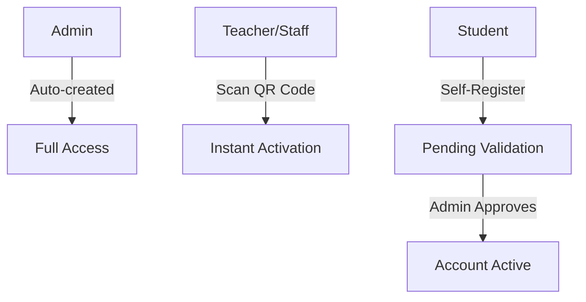

## What is CaféIES?

CaféIES is a comprehensive cafeteria ordering system designed specifically for educational institutions. Built with .NET 8, it provides a seamless experience for students, teachers, and staff to order food while giving administrators complete control over the cafeteria operations.

The system consists of three integrated applications:

<CardGroup cols={3}>
  <Card title="Mobile App" icon="mobile" iconType="duotone">
    .NET MAUI app for iOS and Android where users browse products, place orders, and track their status in real-time.
  </Card>
  <Card title="REST API" icon="server" iconType="duotone">
    ASP.NET Core 8 backend with JWT authentication, Entity Framework Core, and SignalR for real-time updates.
  </Card>
  <Card title="Admin Panel" icon="desktop" iconType="duotone">
    Blazor WebAssembly dashboard for managing products, orders, users, and time slots without touching code.
  </Card>
</CardGroup>

## Key Features

### Smart Time-Based Ordering
CaféIES implements intelligent time restrictions based on school shifts:
- Students can only order during their assigned shift's break times
- Teachers and staff have unrestricted ordering access
- Configurable time slots through the admin panel (no code changes needed)

### Real-Time Order Tracking
Powered by SignalR, the system provides instant updates:
- Cafeteria staff see new orders immediately
- Students track their order status live (Pending → In Preparation → Ready → Delivered)
- No page refreshes required

### Role-Based Access Control
Four user roles with different permissions:
- **Students**: Self-register with shift selection, require admin validation
- **Teachers**: Register via QR code/invitation link (instant approval)
- **Staff**: Register via QR code/invitation link (instant approval)
- **Admin**: Full system access, created automatically on first run

### Secure Registration Flow



## User Journeys

<AccordionGroup>
  <Accordion title="Student Experience" icon="graduation-cap">
    1. Download the mobile app
    2. Register with email and select their shift (Morning/Afternoon/Evening)
    3. Wait for admin validation
    4. Browse the catalog during allowed time windows
    5. Add items to cart and checkout with Apple Pay, Google Pay, or card
    6. Receive order confirmation with order number
    7. Track order status in real-time
    8. Get notified when order is ready for pickup
  </Accordion>

  <Accordion title="Teacher/Staff Experience" icon="chalkboard-user">
    1. Receive QR code or invitation link from admin
    2. Scan/click to register (instant approval, no validation needed)
    3. Order anytime without time restrictions
    4. Same seamless ordering and tracking experience as students
  </Accordion>

  <Accordion title="Cafeteria Staff Experience" icon="utensils">
    1. Open admin panel dashboard
    2. See new orders appear instantly via SignalR
    3. Update order status: Pending → In Preparation → Ready
    4. View stock alerts for low inventory items
    5. Mark orders as delivered when picked up
  </Accordion>

  <Accordion title="Administrator Experience" icon="shield">
    1. Manage product catalog with categories, pricing, and stock
    2. Validate or reject student registrations
    3. Generate QR codes/invitation links for teachers and staff
    4. Configure time slots for each shift without code changes
    5. View dashboard with real-time statistics
    6. Manage user accounts (activate, suspend, delete)
  </Accordion>
</AccordionGroup>

## Technology Stack

<CodeGroup>
```text Backend (CafeIES.API)
- ASP.NET Core 8
- Entity Framework Core
- SQL Server
- SignalR for real-time
- JWT Authentication
- BCrypt for password hashing
```

```text Mobile (CafeIES.MAUI)
- .NET MAUI (iOS + Android)
- MVVM architecture
- CommunityToolkit.MAUI
- SecureStorage for tokens
- XAML for UI
```

```text Admin Panel (CafeIES.Admin)
- Blazor WebAssembly
- Component-based architecture
- SessionStorage for auth
- SignalR client
```
</CodeGroup>

## Why CaféIES?

<Note>
  CaféIES solves the common problem of cafeteria congestion during break times by allowing students to order ahead, reducing wait times and improving the overall dining experience.
</Note>

### Benefits for Schools
- Reduced cafeteria queues and congestion
- Better inventory management with stock tracking
- Data-driven insights into student preferences
- Streamlined payment processing
- No paper orders or manual tracking

### Benefits for Students
- Order from anywhere on campus
- Know exactly when food is ready
- No waiting in long lines
- Track spending and order history
- Simple, modern mobile experience

### Benefits for Cafeteria Staff
- Real-time order notifications
- Clear order queue management
- Inventory alerts before items run out
- Reduced errors from manual orders
- Focus on preparation, not order taking

## Getting Started

Ready to set up CaféIES? Follow our [quickstart guide](/quickstart) to get all three components running in minutes.

<Card title="Quickstart Guide" icon="rocket" href="/quickstart">
  Get CaféIES up and running with step-by-step instructions for the API, admin panel, and mobile app.
</Card>

## Architecture Overview

For a deep dive into how the system works, including the three-tier architecture, shared models, and SignalR communication, check out the [architecture documentation](/architecture).

<Card title="System Architecture" icon="diagram-project" href="/architecture">
  Understand the technical design, data flow, and how components communicate.
</Card>